### **MyoSAT Quick-Start Tutorial**
###### (Myofiber Segmentation and Analysis Tool)
___
**Tutorial for:  MyoSAT v3.5 beta** 
Tutorial Last Update 11/1/2020  
Copyright (c)2020 Cornell University  
 
**Authors:**  
Courtney Stevens, Michael Sledziona, Josh Berenson   
  (Cornell University College of Veterinary Medicine)   
**Additional Contributors:**  
Kareena Sagar (Cornell University College of Veterinary Medicine)  
  
**Primary Contacts:**  
Michael Sledziona  ms66  {at} cornell.edu   
Dr. Jon Cheetham  jc485  {at} cornell.edu

### **INTRODUCTION:**
____
This tutorial describes steps to run segmentation analysis on the small sample image which is included with the macro. This provides a quick test to verify that the macro is working properly. 

The test image is from Murine TA muscle which has been IHC labeled using Collagen V antibody conjugated to streptavidin-Texas Red. Image acquired using a fluorescence  microscope.

> **Test Image Filename:**   SAMPLE_MUSCLE_IMAGE_01.tif  
> **Image Size:**            500x392 pixels   
> **Image Scale:**          0.924 um/pixel   
> **Format:**                16Bit Grayscale TIFF   
> 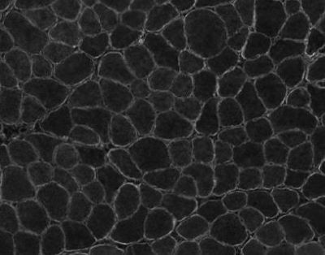

### **INSTALL IMAGEJ:**
____

We recommend installing ImageJ with the FIJI package as it is more user friendly.

'<a href="https://imagej.net/Fiji/Downloads" >CLICK HERE</a>' to download ImageJ.

Mac Users:

Use '<a href="https://kb.franklin.uga.edu/display/public/FOKFC/Fiji+%28ImageJ%29+Installation+Instructions" >THIS GUIDE</a>' for instructions on how to install ImageJ on an Apple device. 

### **TUTORIAL STEPS:**
____

#### **<ins>STEP 1: Start ImageJ. Verify required plugins are installed.</ins>**

Several third party plug-in packages are required to run the script.  The plugin packages may be installed by activating their associated update sites.

 *[ImageJ]->Help->Update….->Manage Update Sites*

> 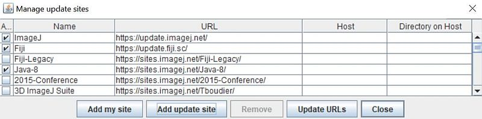

Verify that the following update sites are active:   **Biomedgroup**,  **IJPB-plugins**,  **IJ-Plugins**

> 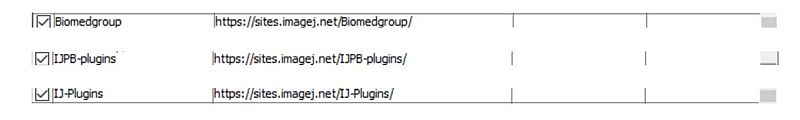

Hit "Close", then "Apply changes"

After adding/activating the update sites, you will need to restart ImageJ.  If the update sites are configured correctly, these plug-in menus should be available:

>**Biomedgroup:**  	 [ImageJ]->Plugins->Ridge Detection  
>**IJPB-plugins:**	[ImageJ]->Plugins->MorphoLibJ  
>**IJ-Plugins:**	[ImageJ]->Plugins->Filters

 

#### **<ins>STEP 2: Open and run the macro code</ins>**

Open the MyoSAT script using the ImageJ macro editor

*[ImageJ]->Plugins->Macros->Edit*

> 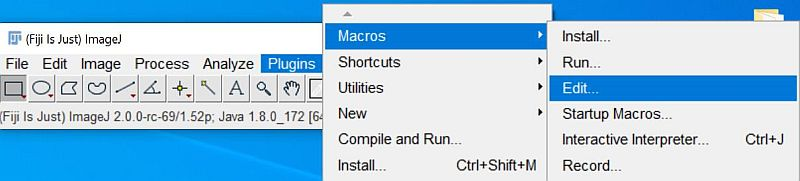
Locate and open the MyoSAT *.ijm macro file  (MyoSAT_v3_4_Beta.ijm)

> 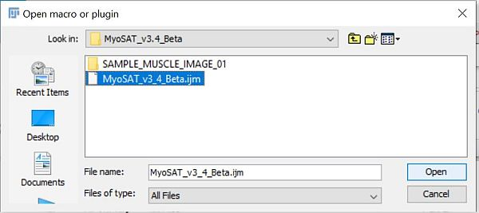

Select Run from the script editor menu.

> 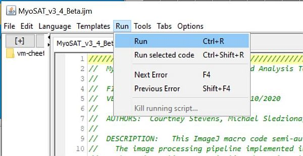

 

#### **<ins>STEP 3:   MACRO Startup Screen</ins>**

<Click OK>

> 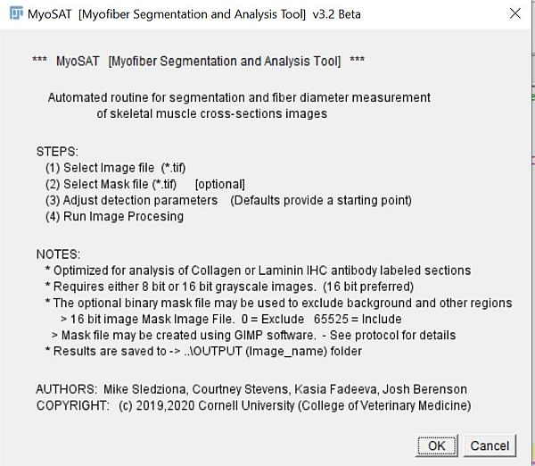

 

#### **<ins>STEP 4:    Select Source Image File</ins>**

Locate the image file: **SAMPLE_MUSCLE_IMAGE_01.tif**

> 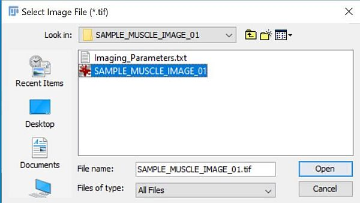

 

#### **<ins>STEP 5:      Dialog:</ins>**

Select a mask image->   [No Mask Image]

> 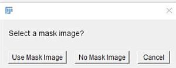

 

#### **<ins>STEP 6:      Main Script Configuration Dialog</ins>**

Use the default values.  Image resolution is 0.924 um/pixel   

*COMMAND MODE:  RUN [use Current Settings]  *
*<Click OK>*

> 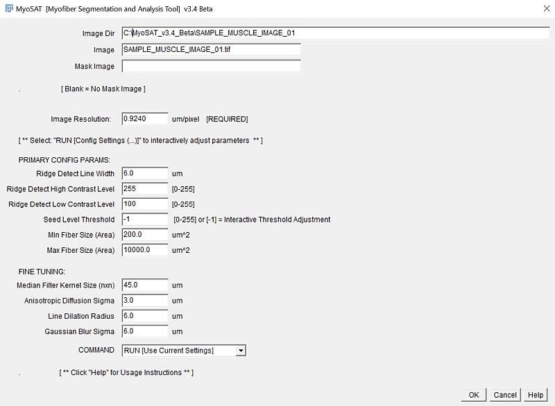

 

#### **<ins>STEP 7:     Adjust Seed Level Threshold</ins>**

This tuning step aids to suppress over-segmentation of the image. As background information: The over-segmentation issue occurs mainly in the case of elongated fiber cross-sections that are associated with oblique sectioning. The seed points used by the watershed segmentation algorithm are the minima in the blurred image shown.  Over-segmentation sometimes occurs because the elongated fiber cross-sections will contain several local minima in this blurred image step. These local minima are an artifact of the image processing approach employed. The seed level adjustment step helps to reduce the issue by combining nearby local seed values within the elongated fibers As caution, setting the seed level adjustment too high will result in an under-segmentation condition.

Set the seed threshold level to a mid-range value:  70
Change the MODE dropdown from PREVIEW -> SET
*<Click OK>*

> 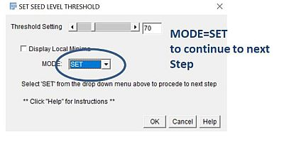
> 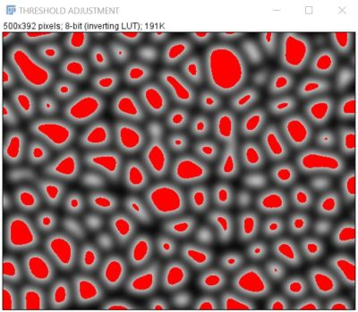

 

#### **<ins>STEP 8:      Review Segmentation Results</ins>**

The macro will next proceed thru the final steps employing classic watershed segmentation. The segmented fiber objects will be analyzed and histogram of fiber sizes will be generated. Additionally a combined image overlaying the segmentation result onto the original image will be displayed.

> 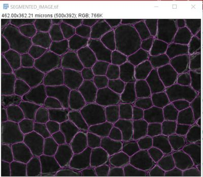
> 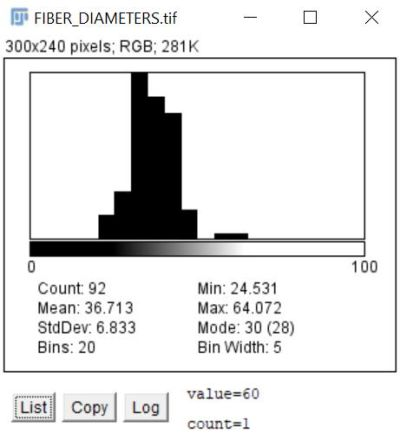

Segmentation Result: 92 fibers with Mean fiber diameter of 36.71 um [Min Feret Diameter]

A new folder will be automatically created in the source image directory. The new folder will contain the segmentation results:

 **..\\OUTPUT (SAMPLE_MUSCLE_IMAGE_01)\\**  
 will have been created which contains the segmentation results.  

> 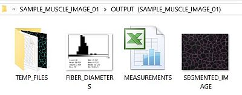

 

## DOCUMENT HISTORY:
___
MyoSAT Quick Start Tutorial Ver 3.4 Beta released 6/12/2020.  
MyoSAT Quick Start Tutorial Ver 3.5 Beta released 6/25/2020. 
