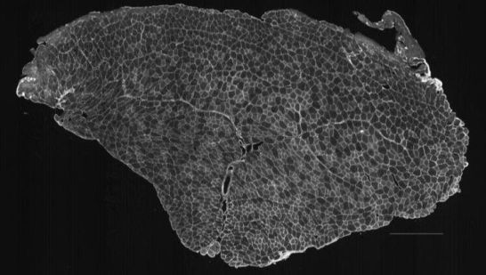
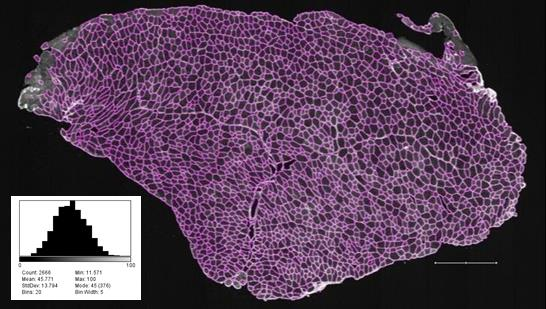

## **MyoSAT User's Guide**
#### ( Myofiber Segmentation and Analysis Tool )
___
**User's Guide for:  MyoSAT v3.5 beta** 
Document Last Update 6/25/2020  
Copyright  &copy; 2020 Cornell University  
**Authors:**  
Courtney Stevens, Michael Sledziona, Josh Berenson   
  (Cornell University College of Veterinary Medicine)  
**Primary Contacts:**  
Michael Sledziona  ms66  @ cornell.edu   
Dr. Jon Cheetham  jc485  @ cornell.edu

### **SOFTWARE DESCRIPTION**
____
MyoSAT is a software package developed for semi-automated segmentation of muscle cross-section images for histology analysis. The image processing has been implemented as an ImageJ macro script. The macro script accepts muscle cross-section images in *.tif format.  Results include an overlay image of the segmentation, fiber size histograms, as well as an excel file output containing the individual fiber sizes.

The MyoSAT macro works with fluorescent antibody labeled cross-sections which target the muscle fiber edges (sarcolemma).  Our research group originally developed MyoSAT to analyze murine and canine skeletal muscle tissues labeled with Collagen V antibody conjugated to a fluorescent label. Images were acquired using a fluorescence slide scanner. The MyoSAT software can be adapted to work with other staining methods including H&E staining if the image is properly formatted.

Our research group developed MyoSAT after having limited success with analysis of large muscle cross-section scans using available software. The image processing pipeline has been optimized to work in challenging cases of weak or uneven staining contrast of the muscle. The macro has been tested to allow automatic segmentation of large area (whole slide) muscle cross-sections containing thousands of fibers - provided sufficient computer memory is available. The software is easy to configure and use.

MyoSAT was developed by the Cheetham Research Group at the Cornell University Veterinary College.   
MyoSAT is being released as an open source project for use and continued development by the research community 

 

### **METHOD:**
___
The image processing approach involves three main stages: The first stage is pre-processing. The image is background leveled to compensate for uneven staining intensity. This is followed by contrast enhancement steps. In the second stage, the macro makes use of [Steger's line detection algorithm](https://doi.org/10.1109/34.659930) to locate fiber boundary candidates. After additional processing steps, The third stage employs [classical watershed segmentation](https://doi.org/10.1117/12.24211) which is used to generate the final segmentation. Fiber sizes are reported by [minimum feret diameter](https://doi.org/10.1016/j.nmd.2004.06.008) as well as other metrics. Details of the algorithm development are detailed in the research paper below:

**Approach for Semi-Automated Measurement of Fiber Diameter in Murine and Canine Skeletal Muscle.**  
Authors:  Courtney R. Stevens, Michael Sledziona, Josh Berenson, Timothy P. Moore, Lynn Dong, Jonathan Cheetham  
**[PREPRINT:   https://www.biorxiv.org/content/10.1101/569780v1]**

**(FIGURE) MyoSAT image processing steps:** **A)** Original image. **B)** Intensity leveling and contrast enhancement. **C)** Ridge detection. **D)** Ridge image post-processing. [dilation + gaussian blur + seed generation] **E)** Watershed segmentation. **F)** Result overlay

 

### **SETUP / INSTALLATION**
___
The macro code requires several external ImageJ plug-in packages.  
The easiest way to install these plugins is by adding/activating the following update sites using the ImageJ / FIJI update tool:  
*[ImageJ]->Help->Update->Manage Update Sites*

* Plugin Name: **Biomedgroup**  
Update Site:   https://sites.imagej.net/Biomedgroup/  
Used For:        Ridge Detection (Steger's Algorithm) 

* Plugin Name:  **IJPB-plugins**  
Update Site:    https://sites.imagej.net/IJPB-plugins/  
Used For:         Binary Morphological Filters, Watershed Segmentation

* Plugin Name:  **IJ-Plugins**  
Update Site:    https://sites.imagej.net/IJ-Plugins/  
Used For:         Fast Median, Perona-Malik Anisotropic Diffusion

 

### **RUNNING THE SCRIPT**
___
Load and run the script from the ImageJ macro editor. 
*[ImageJ]->Plugins->Macros->Edit*

**Startup screen:**

The software will next prompt the user to locate the source image file to analyze as well as an [optional] mask image. 

**Source Image:**   Image format must be either an 8bit or 16bit Grayscale TIF. It should not be a tiled TIF.  Other formats can be imported using the Bio-formats Importer plugin. (Additional details in notes section)

**Mask Image:**  [Optional] This is a binary (black and white image) which may be used to exclude image regions from the analysis. The mask image may be created using image editing software such as open source [GIMP software](https://www.gimp.org/) The mask image is used to exclude non-muscle background, holes in the tissue, as well connective tissues.

Mask Image format:   [8Bit Mask Image: 0=Exclude. 255= Include]    [16Bit Mask Image: 0=Exclude. 65535= Include]

|  |  |

 

 

### **MAIN CONFIGURATION SETTINGS MENU**
___
This is the main configuration page for the script. It allows the user to make image processing adjustments. It also allows the user to activate interactive preview features to aid in tuning of settings for a new analysis.

**Image Resolution:**   [REQUIRED SETTING]  Microns per Pixel. The MyoSAT code scales image processing parameters using the Image Resolution setting. The analysis works best with image resolution in range between 1.0-4.0 microns per pixel.

 

#### **ESTIMATING SUITABLE PARAMETERS

Suitable parameters to use as a starting point may be estimated using the following:  
***w*** = Approximate "ridge" width between adjacent muscle fibers (sarcolemma)       [~6um]  
***davg*** = Expected diameter of a typical muscle fiber.      [~45um] 

 

#### **PRIMARY CONFIG PARAMETERS**

(The first 3 variables below are inputs to Seger's line detection algorithm)

**Ridge Detect Line Width:**  ***~w***

**Ridge Detect High Contrast Level:**  [0..255] Detected ridge segments (fiber boundaries) must have contain a grayscale value above this threshold level. This parameter has a strong effect on detection sensitivity.

**Ridge Detect Low Contrast Level:** [0..255]  Exclude ridge segments fiber boundaries with grayscale values below this level. This helps to suppress image noise often due to non-specific staining of the muscle fiber interiors. (Low Contrast Level < High Contrast Level).  It is recommended to first set Low Contrast Level = 0 as a starting point and then increase as needed.

**Seed Level Threshold:** [0..255] or [-1] = Interactive Adjustment.  This setting aids to avoid over-segmentation in cases of elongated fiber appearance which is often due to oblique tissue sectioning. Fiber location seed values below this threshold level will be merged. It is best to adjust this using MyoSAT's interactive preview feature and so leave this setting at -1.

**Min  /Max Fiber Size (Area um^2)Exclude detected objects outside this range. (Verify settings using output size histogram)

 

#### **FINE TUNING**
 
**Median filter Kernel Size (um):**  [Image Pre-Procesing]   Used to determine local background (non-specific staining) intensity. This is used to aid in "leveling" the image. Leveling is a pre-processing step to provide a uniform background intensity across the image. **(set to ~*davg*)**

**Anisotropic Diffusion Sigma (um):**  [Image Pre-Procesing]   Anisotropic diffusion filtering aids to suppress noise/texture in the image, often due to due to non-specific staining while enhancing the contrast of edges and borders. **(Set this value ~1/2 *w*)** 

**Line Dilation Radius (um) / Gaussian Blur Sigma (um):**  These parameters used to manipulate output of the ridge detection algorithm in preparation for final watershed segmentation step.   **(Set these values to ~*w*)**

 

#### **Script Execution Mode**

**COMMAND** Options Dropdown:

* **RUN [Use Current Settings]:**    Use settings above. Minimal user interaction.

* **RUN [Config Settings (Basic)]:**    Interactive adjustment of primary settings . Use this option to optimize ridge detection sensitivity parameters. Run this to optimize settings for a new set of images.

* **RUN [Config Settings (Advanced)]:**   Additional fine tuning adjustments. In most cases, fine tuning will not be required.

 

### **INTERACTIVE CONFIGURATION DIALOGS**
___

#### **RIDGE DETECT PARAMETER SETTINGS DIALOG**

This dialog box allows the user to interactively ridge detection algorithm setting. The ridge detection filter is which is used to detect and identify the fiber borders. This dialog allows the user to adjust the segmentation sensitivity, and is useful for cases of weak staining / low contrast muscle images. 

The dialog is activated when ***COMMAND:  RUN [Config Settings]*** is selected from the main MyoSAT configuration page. General approach is to first set Low Contrast Threshold to zero and then set Upper Contrast Threshold to a suitable value. (lower values = higher line detection sensitivity). Then Low Contrast threshold may then be adjusted to aid in reducing over segmentation of background regions.

 |  |  |

 

#### **SEED LEVEL THESHOLD SETTINGS DIALOG**

This dialog box allows the user to interactively adjust seed level threshold. Details are described in previous section. The dialog is activated when **Seed Level Theshold** is set to [-1]  (Interactive Adjustment)

 |  | |

 

### **PROGRAM OUTPUT:**
___
The MyoSAT script creates an output folder located in the folder containing the source image. Final segmentation results which include fiber diameter histogram and segmented image are copied to this folder. The configuration settings used for the analysis are saved to this folder as well.

**Output Folder: &nbsp;&nbsp;&nbsp;&nbsp;&nbsp;...\\OUTPUT *(Source Image Name)\\* **
 
* FIBER_DIAMETERS.tif   &nbsp;&nbsp;&nbsp;&nbsp;&nbsp; // Histogram plot of the analyzed fibers.

* SEGMENTED_IMAGE.tif  &nbsp;&nbsp;&nbsp;&nbsp;&nbsp; //   Overlay Image  (Final Segmented Result)

* MEASUREMENTS.xls	&nbsp;&nbsp;&nbsp;&nbsp;&nbsp; // excel file containing fiber diameter and area measurements

* SETTINGS_LOG.txt   &nbsp;&nbsp;&nbsp;&nbsp;&nbsp;  // MyoSAT image processing settings used for the analysis

* TEMP_FILES\\...    &nbsp;&nbsp;&nbsp;&nbsp;&nbsp; //Sub directory with intermediary images generated during image processing steps (Useful for diagmostics)

 

### **ADDITIONAL NOTES:**
___
1. Tiled image scans may be imported using the ImageJ *Bioformats Importer* plugin and resaved into a flat tif format.   *ImageJ->Plugins->Bioformats->Bioformats-Importer*  
You may need to activate the Plugin Update Site:     [Bio-Formats]  https://sites.imagej.net/Bio-Formats/

 

### **REFERENCES**
___
1. **Approach for Semi-Automated Measurement of Fiber Diameterin Murine and Canine Skeletal Muscle.**  
Authors:  Courtney R. Stevens, Michael Sledziona, Josh Berenson, Timothy P. Moore, Lynn Dong, Jonathan Cheetham    **[PREPRINT:   https://www.biorxiv.org/content/10.1101/569780v1]**

1. C. Steger, "An unbiased detector of curvilinear structures," in IEEE Transactions on Pattern Analysis and Machine Intelligence, vol. 20, no. 2, pp. 113-125, Feb. 1998, doi: 10.1109/34.659930

1. IJ-Plugin Toolkit:  http://ij-plugins.sourceforge.net/plugins/toolkit.html

1. Legland, D.; Arganda-Carreras, I. & Andrey, P. (2016), "MorphoLibJ: integrated library and plugins for mathematical morphology with ImageJ", Bioinformatics (Oxford Univ Press) 32(22): 3532-3534, PMID 27412086, doi:10.1093/bioinformatics/btw413

1. Steger's Ridge Detection Inplementation: thorstenwagner/ij-ridgedetection: Ridge Detection 1.4.0 https://zenodo.org/record/845874#.XrVo3ahKguU

 

### **DOCUMENT HISTORY:**
___
MyoSAT User's Guide [for MyoSAT Ver 3.4 Beta] -> Document released 6/16/2020 -MS  
MyoSAT User's Guide [for MyoSAT Ver 3.5 Beta] -> Document Updated 6/25/2020 -JB
