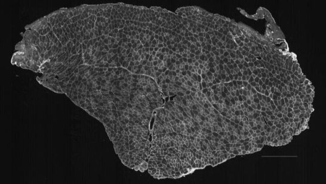
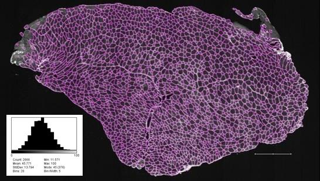

## **MyoSAT** 
### [ Myofiber Segmentation and Analysis Tool ]

#### Automated Skeletal Muscle Fiber Segmentation Software for Histology   Implemented as an ImageJ Macro

  

 	 

### DOWNLOADS
___
1.	**MyoSAT Software Download Package:**  
[MyoSAT_v3.5_Beta.zip](https://github.com/CheethamLab/MyoSAT_ImageJ_Macro/blob/master/Releases/MyoSAT_v3.5_Beta.zip) (Released 6/25/2020)    

2.	**Sample Muscle Cross-Section Image:**  
[MURINE_TA_MUSCLE_SAMPLE_IMAGE_O1.tif](https://github.com/CheethamLab/MyoSAT_ImageJ_Macro/tree/master/Sample_Images/SAMPLE_MUSCLE_IMAGE_01/SAMPLE_MUSCLE_IMAGE_01.tif)

### DOCUMENTATION
___
1. [MyoSAT Quick Start Tutorial](https://github.com/CheethamLab/MyoSAT_ImageJ_Macro/blob/master/Documentation/Quick_Start_Tutorial_MyoSAT_v3_5.md)
2.	[MyoSAT Users Guide](https://github.com/CheethamLab/MyoSAT_ImageJ_Macro/blob/master/Documentation/Users_Guide_MyoSAT_v3.5.md)
3.	Image Mask Generation using GIMP […Available Soon]
4.	H&E stained muscle analysis with MyoSAT  […Available Soon]

### SOFTWARE DESCRIPTION
___
MyoSAT is an ImageJ Macro application developed for automated segmentation of muscle cross-section images for histology analysis. The input is an image of a muscle cross-section.  The image processing routines automatically segment the muscle fibers in the image. Results include an overlay image of the segmentation result as well as fiber size histograms and count data. 

Input images must be either 8 bit or 16 bit grayscale *.tiff format. (tiled format tiffs generated by slide scanners must first be converted to flat format – see user manual)

MyoSAT was originally developed to analyze skeletal muscle labeled with Collagen V antibody using fluorescence immunohistochemistry to label the fiber borders. The software will work with other staining methods including H&E staining if the input image is properly formatted.

Our research group developed MyoSAT after having limited success analyzing large muscle cross-section scans using available software. The image processing pipeline has been optimized to work in challenging cases of weak or uneven staining contrast of the muscle. The macro has been tested to allow automatic segmentation of large area (whole slide) muscle cross-sections containing thousands of fibers - provided sufficient computer memory is available. The software is easy to configure and use.

MyoSAT was developed by the Cheetham Research Group at the Cornell University Veterinary College. 
MyoSAT is being released as an open source project for use and continued development by the research community 

### IMAGE PROCESSING APPROACH
___
The image processing approach involves three main stages: The first stage is pre-processing. The image is background leveled to compensate for uneven staining intensity. This is followed by contrast enhancement steps. In the second stage, the macro makes use of [Steger’s line detection algorithm](https://doi.org/10.1109/34.659930) to locate fiber boundary candidates. After additional processing steps, The third stage employs [classical watershed segmentation](https://doi.org/10.1117/12.24211) which is used to generate the final segmentation. Fiber sizes are reported by [minimum feret diameter](https://doi.org/10.1016/j.nmd.2004.06.008) as well as other metrics. Details of the algorithm development are detailed in the research paper below:

### CITATION:
___
If you use MyoSAT for your research work, please cite the original paper:

**Approach for Semi-Automated Measurement of Fiber Diameterin Murine and Canine Skeletal Muscle.**  
Authors:  Courtney R. Stevens, Michael Sledziona, Josh Berenson, Timothy P. Moore, Lynn Dong, Jonathan Cheetham  
**[PREPRINT:   https://www.biorxiv.org/content/10.1101/569780v1]**

### USAGE AND INSTALLATION NOTES:
___
To become acquainted with the software, we recommend the [MyoSAT Quickstart Tutorial](https://github.com/CheethamLab/MyoSAT_ImageJ_Macro/blob/master/Documentation/Quick_Start_Tutorial_MyoSAT_v3_5.md) followed by reviewing the [MyoSAT User’s Guide](https://github.com/CheethamLab/MyoSAT_ImageJ_Macro/blob/master/Documentation/Users_Guide_MyoSAT_v3.5.md) .

The macro has been tested to work with recent versions of [FIJI/ImageJ](https://imagej.net/Fiji/Downloads)  (Last tested with:   ImageJ version 1.52p)

#### Dependencies
The macro code requires several external ImageJ plug-in packages.  
The easiest way to install these plugins is by adding/activating the following update sites using the ImageJ / FIJI update tool:  
*[ImageJ]->Help->Update->Manage Update Sites*

>Plugin Name: **Biomedgroup**  
>Update Site:   https://sites.imagej.net/Biomedgroup/  
>Used For:        Ridge Detection (Steger's Algorithm) 
>
>Plugin Name:  **IJPB-plugins**  
>Update Site:    https://sites.imagej.net/IJPB-plugins/  
>Used For:         Binary Morphological Filters, Watershed Segmentation
>
>Plugin Name:  **IJ-Plugins**  
>Update Site:    https://sites.imagej.net/IJ-Plugins/  
>Used For:         Fast Median, Perona-Malik Anisotropic Diffusion

#### Running the Macro
We recommend running the script from the ImageJ macro editor.
*Plugins->Macros->Edit*

1. Locate and open the macro file:      **MyoSAT_v3_5_Beta.ijm**
1. From the macro editor: *\<Click Run\>*
1. Further instructions:
* [MyoSAT Quickstart Tutorial](https://github.com/CheethamLab/MyoSAT_ImageJ_Macro/blob/master/Documentation/Quick_Start_Tutorial_MyoSAT_v3_5.md)
* [MyoSAT User’s Guide](https://github.com/CheethamLab/MyoSAT_ImageJ_Macro/blob/master/Documentation/Users_Guide_MyoSAT_v3.5.md)

### REFERENCES
___
1. **Approach for Semi-Automated Measurement of Fiber Diameterin Murine and Canine Skeletal Muscle.**  
Authors:  Courtney R. Stevens, Michael Sledziona, Josh Berenson, Timothy P. Moore, Lynn Dong, Jonathan Cheetham    **[PREPRINT:   https://www.biorxiv.org/content/10.1101/569780v1]**

1. C. Steger, "An unbiased detector of curvilinear structures," in IEEE Transactions on Pattern Analysis and Machine Intelligence, vol. 20, no. 2, pp. 113-125, Feb. 1998, doi: 10.1109/34.659930

1. IJ-Plugin Toolkit:  http://ij-plugins.sourceforge.net/plugins/toolkit.html

1. Legland, D.; Arganda-Carreras, I. & Andrey, P. (2016), "MorphoLibJ: integrated library and plugins for mathematical morphology with ImageJ", Bioinformatics (Oxford Univ Press) 32(22): 3532-3534, PMID 27412086, doi:10.1093/bioinformatics/btw413

1. Steger’s Ridge Detection Inplementation: thorstenwagner/ij-ridgedetection: Ridge Detection 1.4.0 https://zenodo.org/record/845874#.XrVo3ahKguU

1. Strange, H., Scott, I. & Zwiggelaar, R. Myofibre segmentation in H&E stained adult skeletal muscle images using coherence-enhancing diffusion filtering. BMC Med Imaging 14, 38 (2014). https://doi.org/10.1186/1471-2342-14-38

### LINKS TO OLDER VERSIONS:
___
MyoSAT_v2_0_Beta.zip Released 5/6/2020  {LINK:  https://github.com/CheethamLab/MyoSAT_ImageJ_Macro/releases/tag/v2.0_Beta }

### Copyright Notice
___
**Copyright Notice:**
Copyright &copy; 2020 Cornell University   
For Public Release

**Authors:**  
Courtney Stevens, Michael Sledziona, Josh Berenson   
  (Cornell University College of Veterinary Medicine)  

**Primary Contacts:**  
Michael Sledziona  ms66 @ cornell.edu   
Dr. Jon Cheetham  jc485 @ cornell.edu
